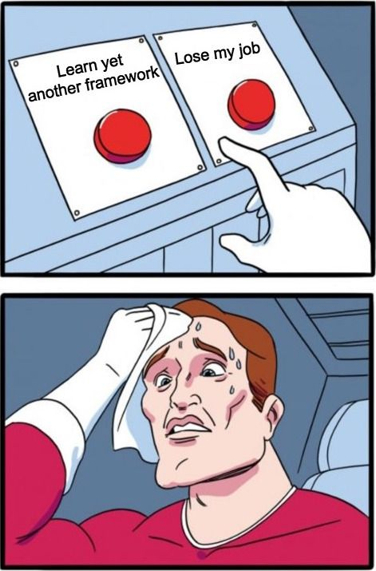
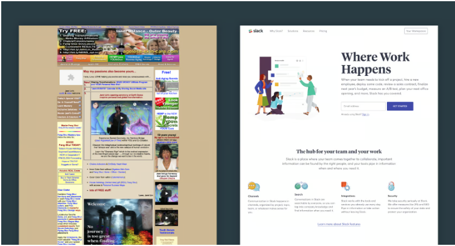

User interface frameworks change rapidly; new ones emerge every year, and sometimes even every month. Consequently, many software engineers and UI designers need to ensure that they stay up-to-date with the latest frameworks to secure their jobs. However, why are people using UI frameworks? To answer this question, I want you to think about the principles of software design. 

Certainly, there are no strict guidelines for software design, but there are certain features that need to be included for it to be considered as “good” software design.

## CONSISTENCY

Let’s talk about Bootstrap first. Essentially, Bootstrap is a collection of CSS properties that can be applied to elements in HTML using classes. Of course, if you want to style the website, you have to use CSS, but Bootstrap organizes it, providing consistency of the website. 

There are many ways to achieve the same result in HTML, such as centering a div, but which method is the best? In fact, there isn't a “best” method to do it, but using one method and then another can potentially affect other elements on the web page. What if multiple people work on the same project, and everyone has their method of doing so? Therefore, “consistency” within the webpage or among people working on this project is one of the benefits of using frameworks.

## RESPONSIVE

A responsive web page is a web page that can function properly on any kind of device. However, 30 years ago, “responsive” might not have been an important feature for a web page because not many people had access to the internet, and most of the devices that could access the internet were computers. Therefore, having a web page that displays all the information is more than enough. Nowadays, however,  there are phones, ipads, laptops, computers and numerous different devices that can access the internet.  If a web page cannot be responsive, that is not good software. 

To adapt to the rapid development of hardware, a responsive web page is necessary. A UI framework can accomplish this quickly and easily. Especially for front-end development, if the UI is not responsive, it will really be considered a “bad” software because it will have trouble interacting with users. 

## Downside

Of course, there are some downsides to using frameworks. Like I mentioned in the introduction, software developers may have to stay up-to-date with the latest frameworks to secure their jobs. This is difficult not only because it involves learning another programming language, but also understanding the syntax, the logic behind it, and many other things that need to be familiarized with.

It’s fair to say, “That’s what a software engineer looks like.” However, the downsides not only cause trouble for designers but also limit the code itself because using a framework means that your code needs to adhere to some rules, including more or less boilerplate code. On the other hand, you need to upgrade the frameworks and update the legacy code so the web pages can be supported.

## Conclusion

Undoubtedly, using frameworks can bring many benefits to your software, but the effort spent behind it is still a factor that we need to consider. To end this conversation, I would like to quote from William Shakespeare’s tragedy, Hamlet in Act II, Scene 2.  “There is nothing either good or bad, but thinking makes it so”. 

