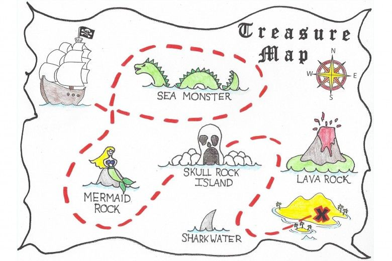

## Treasure Map

Where is the treasure? Well, obviously, it's at the 'X' mark on the treasure map. All you need to do is follow the route on the map, and you can find the treasure! 
Isn’t that similar to a design pattern? One of the coolest features of React.js is its rendering capability, which makes React.js truly 'reactive.' 
Personally, I've encountered many situations where React.js didn’t render the elements properly because I didn’t follow the design pattern correctly. 
Therefore, there were some accidents on my way to finding the treasure. However, those accidents were good learning experiences because the treasure map or design pattern is provided by pioneers who have prior experiences, and sometimes their instructions may not clearly convey the design pattern. For example, the treasure map directs you to turn right when you see the mermaid rock, but there are two mermaid rocks—which one is the map referring to? Therefore, accidents indicate that you might understand the design pattern incorrectly.

## Here is another question. Is the treasure on the map really what you want?  

## My experiences
Imagine following the route on the treasure map, only to find that the treasure doesn’t match your expectations. What would you do? In my current final projects, Meteor has set up a really good design pattern for writing and reading MongoDB, with a strict structure for each document using simple schema. It’s great for consistency of collection and database. However, consider another situation: if a restaurant wants a database for orders that customers made, would all the orders have the exact same structure? Perhaps not because customers can order different items. Therefore, a more flexible structure is suitable for this situation. We have a design pattern for static structure we can modify a little bit to get the desired document structure.

## Conclusion

The design pattern directs you to a general solution for common problems, much like a treasure map leading to a treasure that most people seek. However, there are always individuals seeking different treasures. They modify the route and discover their own treasures.
