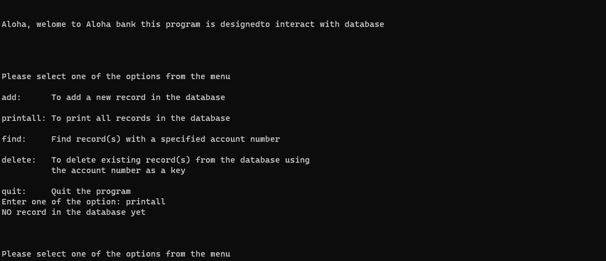

# Introduction
This is a project that I do in ICS 212. This is a basic bank database system where user can enter data such as name, address, and account number to interact with the bank system. 

# interface
The interface is where data is received from the user and interacts with the bank system. For security concerns, this is the only way for users to interact with the database. Users can choose to add, find, delete, quit, or print data that is in the database. 

```c
int main(int argc, char *argv[])
{
    char name[30];
    char temp[80];
    char address[50];
    char user_input[20];
    int EndOfLoop = 1;
    int i = 0;
    int check = 0;
    int AccountNumber = 0;
    struct record *start = NULL;
    if (argc <= 2)
    {
        if (argc == 2)
        {
            if (strcmp(argv[1], "debug") == 0)
            {
                debugmode = 1;
                check = 1;
            }
        }
        else
        {
            check = 1;
        }
    }
    if (check == 1)
    {
        readfile(&start, "database.txt");
        printf("\n\nAloha, welome to Aloha bank this program is designed");
        printf("to interact with database\n\n");
        do
        {
            i = 0;
            printf("\n\n\nPlease select one of the options from the menu\n");
            printf("\nadd:      To add a new record in the database\n");
            printf("\nprintall: To print all records in the database\n");
            printf("\nfind:     Find record(s) with a specified account number\n");
            printf("\ndelete:   To delete existing record(s) from the database using");
            printf("\n          the account number as a key\n");
            printf("\nquit:     Quit the program\n");
            printf("Enter one of the option: ");
```

# Record

For each record we store in the system, we create a C struct that holds data such as account numbers and names.

```c
struct record
{
    int            accountno;
    char           name[30];
    char           address[50];
    struct record* next;
};
```

# Database
In this database, all the data is stored as Linked List where each record has information such as account number and address and a pointer to another record. This kind of design make the modification of database easier since the system does not need to reallocate memory everytime a new data is entered.

# Example
After the user enters some data into the interface, the interface will transfer this data to the bank's system. Depending on what the user wants to do, the bank system will execute the corresponding action. For instance, if the user wants to print all the data, the system will execute the following code.

```c
void printAllRecords(struct record *start)
{
    int count = 0;
    struct record *PointerRecord;
    PointerRecord = start;
    while (PointerRecord != NULL)
    {
        count++;
        printf("\n\nThe account number is : %d\n", PointerRecord->accountno);
        printf("The name is : %s\n", PointerRecord->name);
        printf("The address is : %s\n", PointerRecord->address);
        PointerRecord = PointerRecord->next;
    }
    if (count == 0)
    {
        printf("NO record in the database yet\n");
    }
    if (debugmode == 1)
    {
        printf("\n\n\ncalled printAllRecords\n");
        printf("the function has parameter struct record *start\n");
        printf("the loop run %d times \n", count);
    }
}

```

Additionally, after the user has finished interacting with the database, the database will export all the information stored within it. This ensures that the data from the previous user's session remains available for the next user when they access the database.

Source: <a href="https://github.com/shu4dev/BankDatabase"><i class="large github icon "></i>Bank System</a>
