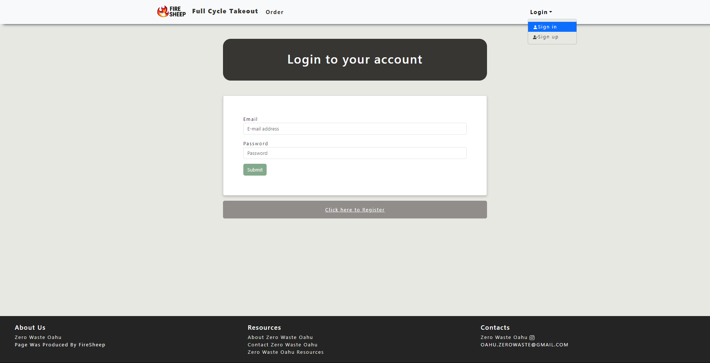

# Introduction
This is the final project for ICS 314 where we've chosen to adapt the challenges from the Hawaii Annual Coding Challenges (HACC) for our project. 
The challenge is provided by the non-profit organization <a href="https://www.fullcycletakeouthawaii.org/">Full Cycle Takeout</a>. 
The main goal of this project is to create an application that allows customers to borrow and return the reusable containers and utensils provided by the organization.

# Overview

The web application aims to facilitate the borrowing and returning process of reusable containers and utensils provided by a particular organization or service.The platform serves as a user-friendly interface that enables individuals to easily access, borrow, and return these sustainable items.
This project provides user-friendly interface that allow user to naviagete our website. 

# User Registration and Authentication 

Users can create accounts, log in securely, and manage their profiles. Personal information and borrowing history can be securely stored.

# Browse and Select Items 
The application will showcase available containers and utensils, displaying details such as types, sizes, and availability. Users can browse through the inventory and select items for borrowing.

## Administrative Panel
An admin interface to manage inventory, track borrowed items, handle user accounts, and generate reports on usage and item popularity.

## Contribution
In this project, my primary focus was on fortifying the backend infrastructure and database architecture, ensuring robust functionality and seamless data management. 
I took charge of designing and implementing core backend systems using languages using Node.js, structuring efficient database schemas, 
and developing APIs for smooth communication between the frontend and backend. Additionally, upon request, I also delved into specific frontend functionalities, 
aligning them with the backend logic to enhance user experience and overall application performance. 
My aim was to create a cohesive ecosystem where the backend operations seamlessly supported the frontend interface, 
contributing to a well-integrated and efficient web application for users to borrow and return reusable containers and utensils.

Group mate

Anson Leung 
Samuel Yang 
Joy Tan 

## What do we learned ?
Throughout this project, our learning extended far beyond the technical aspects of developing a web application. While mastering the use of diverse frameworks was undoubtedly valuable, the most significant lessons stemmed from the realms of communication, teamwork, project management, and issue resolution. Collaborating on this endeavor honed our abilities to articulate ideas effectively, ensuring seamless communication among team members. Emphasizing teamwork, we discovered the power of collective effort, leveraging everyone's strengths to achieve our common goals. Learning to manage a project from conception to execution taught us invaluable organizational skills, including task delegation, timeline adherence, and resource management. Most importantly, encountering and resolving challenges within the project enriched our problem-solving abilities and fostered adaptability in navigating unforeseen obstacles. In essence, this experience transcended technical skill acquisition, equipping us with indispensable soft skills vital for success in any collaborative endeavor.

Source: <a href="https://314firesheep.github.io/)https://314firesheep.github.io/">Organization GitHub Page</a>
