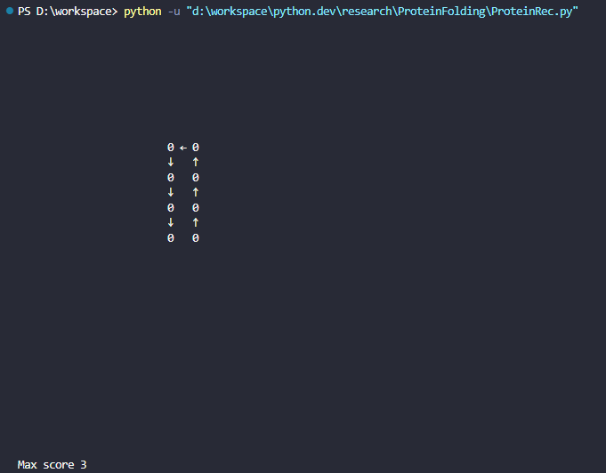

<hr>

# Introduction
This Python script is dedicated to a research project during the summer. The goal of this project is to find the best way to fold proteins using a hydrophobic-polar protein folding model. The concept of the "best way" refers to a method for transforming a string into 2D or 3D shapes that best satisfy the criteria of hydrophobic-polar protein folding. 

<hr>

# hydrophobic-polar protein folding model

The hydrophobic-polar protein folding model is a highly simplified model for examining protein folds in space, first proposed by Ken Dill in 1985. In this model, a protein is represented as a string containing 1s and 0s. Between each 1 or 0, there is a connection point where the protein can be folded. 

In order to score, the following condition must be satisfied:

1. The number must be next to each other without a connection
2. Both number must be 0

To Better illustrate this idea, Let's take a look at a example

# example

Given the input is [0, 0, 0, 0, 0, 0, 0, 0], the script will produce:



# Code
To achieve this goal, we use recursive backtracking.
```python
def ProteinFolding(Acidseq, grid, Curnum, y, x, pts, resgrid):
    global Maxpts
    global y_move
    global x_move
    global direc
    if Curnum == len(Acidseq):
        if pts > Maxpts:
            Maxpts = pts
            CopyArray(grid, resgrid, len(grid))
        return resgrid
    
    for i in range(4):
        
        y_prog = y + y_move[i]
        x_prog = x + x_move[i]
        
        y_new = y_prog + y_move[i]
        x_new = x_prog + x_move[i]

        if isValid(grid, y_new, x_new):

            grid[y_prog][x_prog] = symbol[i]
            grid[y_new][x_new] = Acidseq[Curnum]
            pts_new = pts + Checkpts(grid, y_new, x_new, direc[i])
            CopyArray(resgrid, ProteinFolding(Acidseq, grid, Curnum + 1, y_new, x_new, pts_new, resgrid), len(grid))
            grid[y_new][x_new] = " "
            grid[y_prog][x_prog] = " "

    return resgrid
```

Source: <a href="https://github.com/shu4dev/ProteinFolding"><i class="large github icon "></i>Protein Folding</a>
