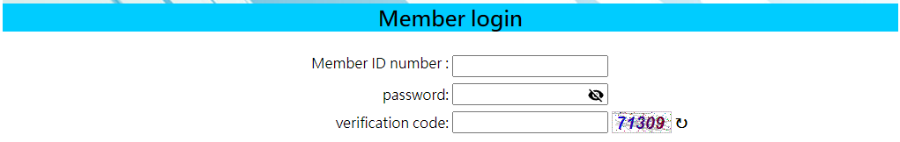

<hr>

# Introduction
This script is written in Python and utilizes a library called Selenium, which can detect elements in HTML and interact with them.
I created this Python script for my dad to help him reserve a badminton court. At the gym he frequents, court reservations must be made online through their website. The reservation for next week becomes available at midnight. My dad had difficulty operating the computer quickly enough to secure a court, so this script is designed to assist him.

<hr>

# Start the ChromeDriver

The first part of the script is just the setup of ChromeDriver.  Essentially, driver = webdriver.Chrome() is the ChromeDriver. Options, service, options.add_() are just parameters for the ChromeDriver. I also import some common libraries as well for further functionality. 

```python
from selenium import webdriver
from selenium.webdriver.chrome.service import Service
from selenium.webdriver.chrome.options import Options
from twocaptcha import TwoCaptcha
import time
import os 
import calendar
from datetime import datetime

options = Options()
service = Service( executable_path="your_path")
options.add_experimental_option("detach", True)
driver = webdriver.Chrome( 
service = service,
options = options)
```

<hr>

# Get the Time Right

To ensure this script runs at the time we want I write another getTime() function. Since we want to run the script at 12:00 am one week we have the date we want to reserve. I simply use the calendar to calculate the date. This function returns year, month, day, in string. 

```python
def getTime():
    now        = datetime.now()
    year       = int(now.strftime("%Y"))
    month      = int(now.strftime("%m"))
    TodayDay   = now.strftime("%d")
    day        = int(now.strftime("%d"))
    monthrange = calendar.monthrange(year, month)
    if day + 8 > monthrange[1]:
        month = str(month + 1).zfill(2)
        day   = str(day + 8 - monthrange[1]).zfill(2)
    elif day + 8 > monthrange[1] and month == 12:
        year  = str(year + 1) 
        month = str(1).zfill(2)
        day   = str(day + 8 - monthrange[1]).zfill(2)
    else:
        year  = str(year).zfill(4)
        month = str(month).zfill(2)
        day   = str(day + 8).zfill(2)
    print("Today is ", year, "/", month,"/", TodayDay, 
          "\nIntend to reserve for ", year, "/", month,"/", day)
    return str(year), str(month), str(day)
```

<hr>

# Captcha



<hr>

In the image above, I encountered a membership page that required members to enter a verification code (Captcha). To bypass this, I use the TwoCaptcha API, which helps me solve the Captcha and send back the verification code. Essentially, the code below captures the Captcha element on the website, sends it to the TwoCaptcha database, and ultimately retrieves the verification code.

```python

    captcha_img = driver.find_element("xpath", "/html/body/table[2]/tbody/tr/td/form/table/tbody/tr[3]/td[2]/img")
    captcha_img.screenshot('your_path')


    api_key = os.getenv('APIKEY_2CAPTCHA', 'your_key')

    solver = TwoCaptcha(api_key)

    try:
        result = solver.normal('your_path')

    except Exception as e:
        print(e)
    else:
        code = result['code']
        return code
```

<hr>

# Run!!!

In the following code, we simply run the script with year, month, and day. Essentially, the script will start the ChromeDriver, skip all the alerts, and bypass the member page. After bypassing the member login page, the script will wait until 12:00 AM. At the moment of 12:00 AM, the script to access the reservation page directly by using year, month, day we got from the get time function. 

```python
def process(year, month, day):
    solved = False
    while solved != True:
        code = solve()
        driver.find_element("xpath", "/html/body/table[2]/tbody/tr/td/form/table/tbody/tr[3]/td[2]/input").send_keys(code)
        driver.find_element("xpath", "/html/body/table[2]/tbody/tr/td/form/table/tbody/tr[4]/td/input").click()
        try:
            driver.switch_to.alert.accept()
            time.sleep(1)
        except Exception as e:
            print(f"An exception occurred: {e}")
            solved = True

    now = datetime.now()
    hour = now.strftime("%H")
    min  = now.strftime("%M")
    sec  = now.strftime("%S")
    print("Timestamp", hour, " : ", min, " : ", sec)
    time.sleep(((59 - int(min)) * 60) + (59 - int(sec)) + 1)
    DoneTime = datetime.now()
    print("Done Time", DoneTime.strftime("%H:%M:%S"))
    
    driver.get("https://fe.xuanen.com.tw/fe01.aspx?module=net_booking&files=booking_place&StepFlag=2&PT=1&D="+year+"/"+month+"/"+day+"&D2=1")
    driver.find_element("xpath", "/html/body/table[1]/tbody/tr[3]/td/div/form/table/tbody/tr/td/span/div/table/tbody/tr[2]/td/span/table/tbody/tr[37]/td[3]/img").click()
    driver.switch_to.alert.accept()
    time.sleep(600)
```

<hr>

# Wrap Up

In conclusion, the script runs as how a human will operate the website, but in a faster way. It's a relatively simple and easy script. However, to bypass the member login page and optimize the speed, I do use outside sources and a little bit of observation to help me achieve that. 


Source: <a href="https://github.com/shu4dev/WebAutomation/edit/main/BotDemo.py"><i class="large github icon "></i>WebAutomation</a>
